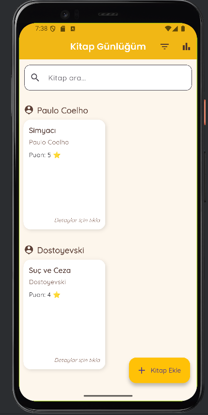
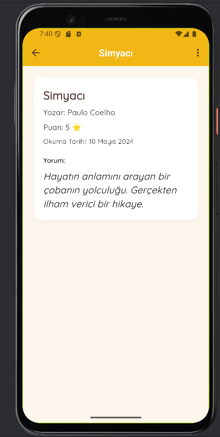
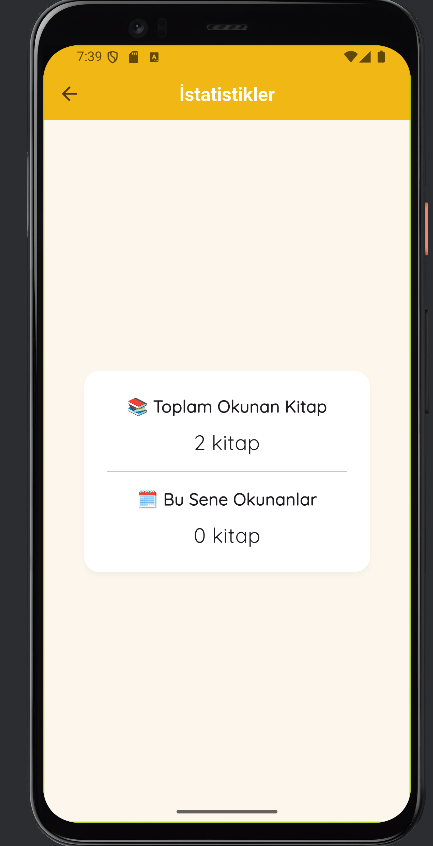
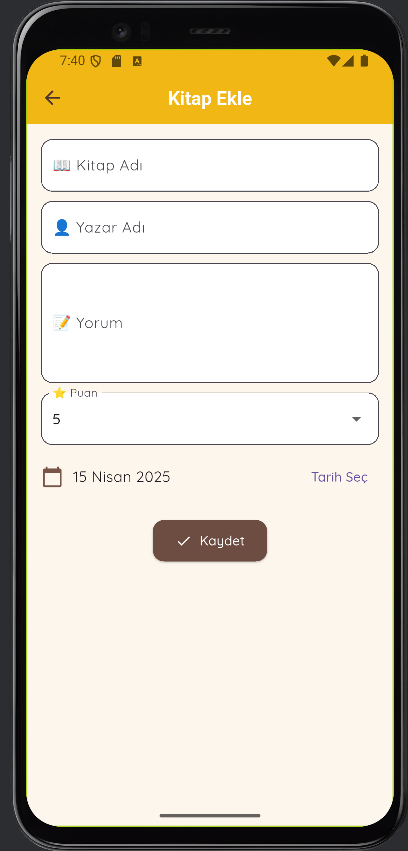

# 📚 Book Diary App

A simple and clean book diary application built with Flutter. This app allows users to add books they've read, rate them, and write personal reflections.

## 🧩 Features

- Add new books with title, author, rating, and personal comment
- View a list of all added books
- Detail view to read full comments
- Stylish and user-friendly UI
## 🚀 Installation

To run this project on your local machine:

bash
git clone https://github.com/zeynepsila/ReadingList.git
cd ReadingList
flutter pub get
flutter run
🔧 Technologies Used
Flutter

Dart

Google Fonts

GitHub for version control

## ✨ Screenshots

### 🏠 Home Page

### 📖 Detail Page

### 📊 Statistics

### ➕ Add Book

### 🔢 Sorting

📌 Notes
This app is currently under development.
Feedback, issues, and contributions are welcome!

Author: zeynepsila
Project: ReadingList
Year: 2025 
